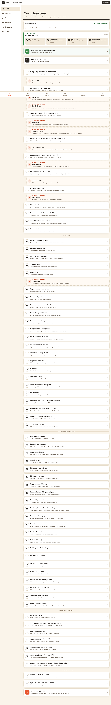

# Korean Core Starter

Korean Core Starter is a browser-based Korean self-study app for learners who want practical Korean first: Hangul, daily phrases, grammar, review, speaking imitation, roleplay, dictionary lookup, and newcomer guides for life in Korea.

Live app: https://busanthebox-coder.github.io/korean-core-starter/



## Run Locally

```bash
npm install
npm run dev -- --host 127.0.0.1
```

The dev server prints a local URL. Open `/korean-core-starter/#/learn` if you want the same base path used by GitHub Pages.

## Verify

```bash
npm test
npm run build
```

## Data Pipeline

Source content lives under `scripts/*-src/`, `scripts/guide-src/`, `scripts/rich-chapters/`, and related JSON files. The generated app data lives under `korean/data/` and is bundled by:

```bash
node scripts/generate-korean-data.mjs --accept-manifest-additions
node scripts/apply-curriculum-structure.mjs
node scripts/build-app-data.mjs
node scripts/verify-data-integrity.mjs
```

Use `--accept-manifest-additions` only when intentionally adding new source entries. See `scripts/README.md` and `docs/superpowers/specs/v2-upgrade/00-README.md` before editing content.

## Deploy

Deployment is manual and should only run when explicitly requested:

```bash
npm run deploy
```

## Project Docs

The active v2 upgrade specs are in `docs/superpowers/specs/v2-upgrade/`. They define execution order, content briefs, data safety rules, and completion records.
